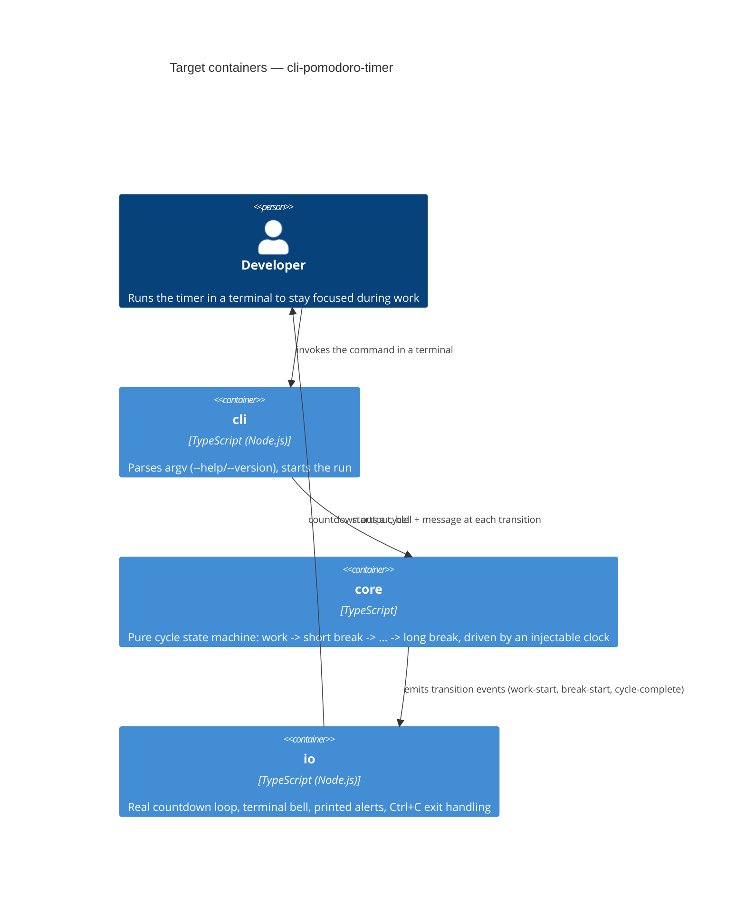

# Architecture map — cli-pomodoro-timer

> The **target foundation** for this project (nothing is built yet), fixed with the owner during
> `survey`'s greenfield pass and read by `specify` / `design` / `tasks` / `implement` /
> `scaffold`. Refresh with `survey` once real code lands and drifts past `reflects_commit`.

## Stack

- Language / runtime: TypeScript on Node.js (>=18 LTS) — chosen for ease of sharing informally
  with other developers (`npx`/`node` run it directly, no separate install step to distribute a
  binary).
- Frameworks: none — no HTTP framework, no database. This is a single-purpose CLI with a fixed
  cycle; `argv` handling is limited to `--help`/`--version` (durations are fixed per the idea
  brief, so there is nothing else to parse).
- Build / test / lint: `npm run build` (tsc) / `npm test` (Vitest) / `npm run lint` (eslint).

## C4 — target baseline

## Module inventory

| Module | Path | Layers | Wired at | Responsibility |
|---|---|---|---|---|
| cli | `src/cli.ts` | entry point | `src/cli.ts` (to be created) | Parses `--help`/`--version`, invokes `core` with the fixed 25/5/15 cycle config |
| core | `src/core/` | domain (pure) | `src/core/cycle.ts` (to be created) | The work/short-break/long-break state machine; no timers, no I/O — takes a clock, returns transitions, fully unit-testable |
| io | `src/io/` | infra | `src/io/timer.ts` (to be created) | Drives `core` in real time (`setInterval`), prints the countdown, fires the terminal bell (`\a`) + message on each transition, handles `SIGINT` for a clean immediate exit |
| history | `src/history/` | infra | `src/io/timer.ts` calls `src/history/record.ts` | Opt-in, append-only session-history writer (v2) — resolves the OS-conventional per-user data directory and appends one JSON line per naturally-completed phase; called only from `io`. See `docs/features/session-history/`. |

## Conventions (cited — the rules a new feature must match)

<!-- N/A: no existing code yet — these are the rules being FIXED for the scaffold and every
feature after it, per G4/G5 of the greenfield foundation session. Nothing to cite until scaffold
materializes the skeleton; re-survey after that to add real file:line citations. -->

- **Module wiring / registration:** `cli` is the only entry point; it composes `core` + `io` directly (no DI container — the project is too small to need one).
- **Error handling:** uncaught errors print to `stderr` and exit non-zero; `SIGINT` (Ctrl+C) exits immediately with code `0` (per the idea brief — no confirm, no pause), following standard Node process conventions.
- **IDs:** not applicable — the tool has no persisted entities.
- **Persistence / DB access:** none by default. The only exception is the opt-in, append-only
  session-history writer in `src/history/` (v2, `docs/roadmap.md` step 6) — off unless
  `POMODORO_HISTORY=1` is set, and even then it's a flat `history.jsonl` file, never a datastore:
  no query engine, no schema, no migrations directory. See `docs/features/session-history/`.
- **Migrations:** not applicable — no datastore.
- **Tests:** Vitest; `core`'s state machine is unit-tested with a fake clock (no real 25-minute waits); `io` gets a thin smoke test only, since it's mostly timers/process I/O; `history` (v2) gets full unit + real-filesystem integration tests, its one external boundary.
- **Inter-module communication:** direct function calls / callbacks in-process — no events bus, no network calls (single local process).

## Datastores

| Store | Engine | Accessed via | Notes |
|---|---|---|---|
| — | — | — | No real datastore. The opt-in `src/history/` writer (v2) appends one JSON line per completed phase to a flat `history.jsonl` file under the OS-conventional per-user data directory — see `docs/features/session-history/`. |

## Frontend / UI foundation

<!-- N/A: no frontend — this is a terminal-only CLI, not a web/mobile/desktop app. -->

## Where things live / closest precedents

- A new CLI behavior (e.g. a future flag) → `src/cli.ts`, following the argv-parsing shape set up in scaffold task S1.
- Cycle/state-machine logic → `src/core/cycle.ts`, modeled on the same pure-function, fake-clock-testable style.
- Real-time/I-O behavior (timers, printing, signals) → `src/io/timer.ts`.
- History/persistence logic → `src/history/` (v2, opt-in) — see `docs/features/session-history/`.

## Constraints & known tech-debt

- No code exists yet — this map is the **target** the `scaffold` skill will materialize, not a description of a current repo.
- The foundation deliberately excluded persistence, config files, and background/daemon mode (per `docs/idea-brief.md` §5) — a future feature that needs any of these requires revisiting ADR 0001/0002 or adding a new ADR, not silently bolting it on. Session-history (v2) is exactly that revisit for persistence — see **ADR-0001** under `docs/features/session-history/adr/` — and remains the only exception; config files and background/daemon mode are still excluded.

## Reconciliation with the authored architecture doc

No authored architecture doc exists (no `docs/architecture.md`, no root `CLAUDE.md` yet — `scaffold` will write the conventions doc from this map). This map is the current reference.
