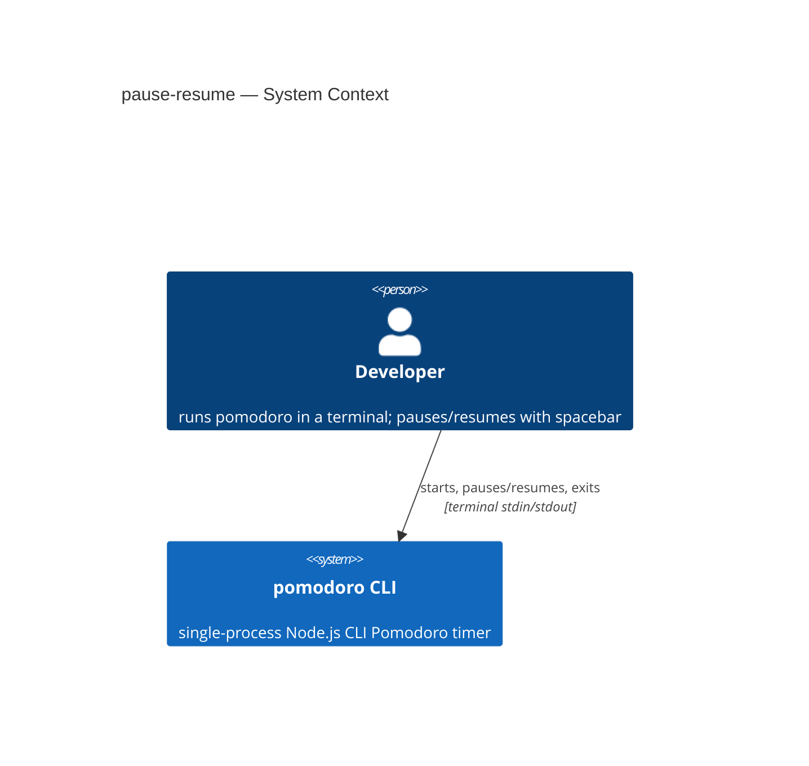
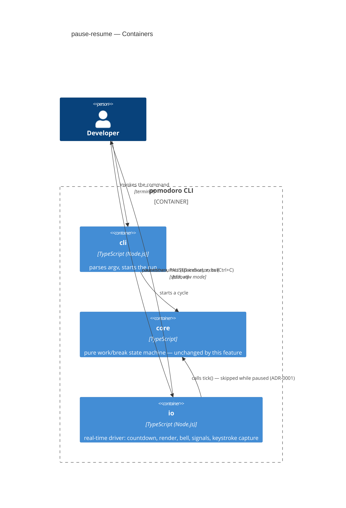
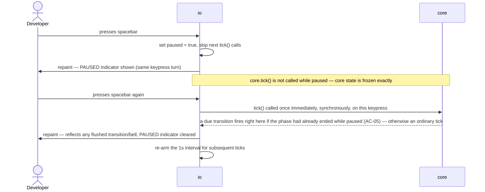
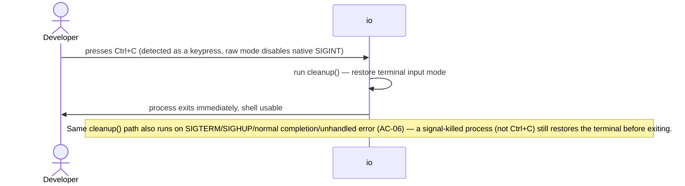
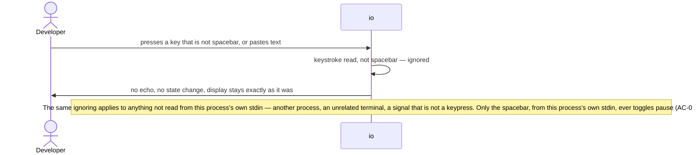
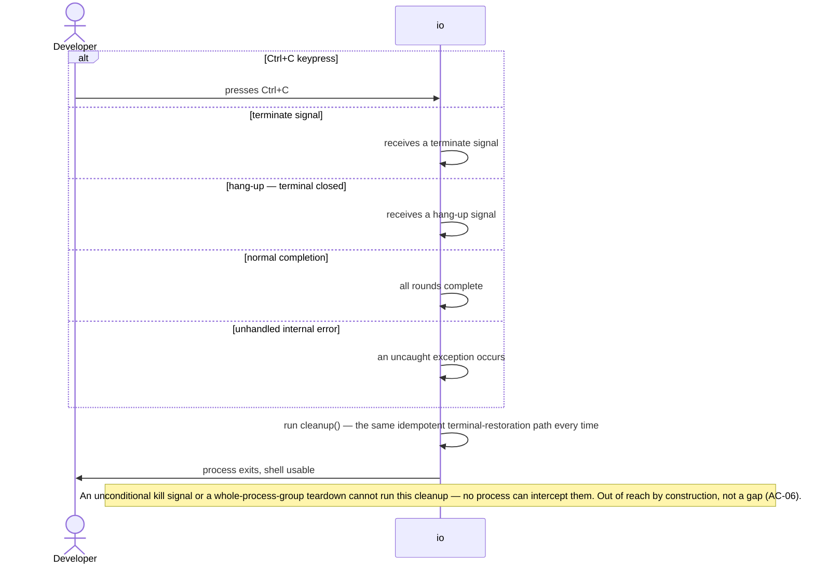
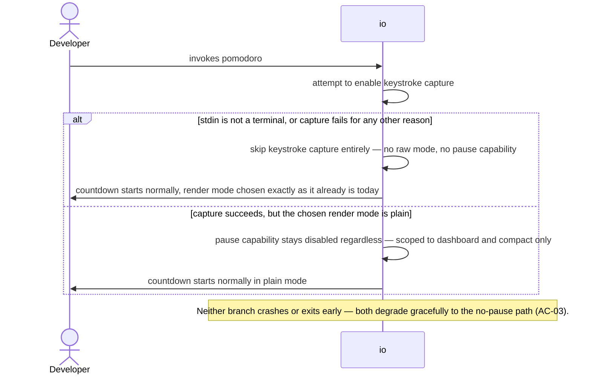

# Software Architecture Document — pause-resume

<!-- 12 Arc42 sections. Empty section → <!-- N/A: <one-line reason> -->. -->
<!-- C4 Context (L1) lives inline in §3. C4 Container (L2) lives inline in §5. -->
<!-- Numbers in §10 come VERBATIM from spec.md §6 NFR — no inventing, no rounding. -->

## 1. Introduction and goals

**Intent.** Add a spacebar-triggered pause/resume to `pomodoro`'s countdown so a developer interrupted mid-phase can freeze progress and resume exactly where they left off, without breaking the tool's existing Ctrl+C clean-exit guarantee (spec §2 Goals).

**Top-3 quality goals (1-liners; full scenarios in §10):**

1. Terminal-restoration reliability — never leave a developer's shell in a broken input mode, on any exit path this process can intercept.
2. Paused-time accuracy — the remaining phase time is preserved exactly across any number of pause/resume cycles.
3. Pause/resume visual responsiveness — the "PAUSED" state is reflected immediately, on the triggering keypress.

**Stakeholders.**

| Role | Interest | Sign-off owner? |
|---|---|---|
| developer (CONTEXT glossary) | the person running `pomodoro`, interrupted mid-phase | No |
| Vitalii (owner, solo maintainer) | SAD approval | Yes |

<!-- Decision overrides (¶4) — none this pass. -->

## 2. Constraints

**Technical.**
- TypeScript on Node.js (>=18 LTS) — unchanged.
- No framework, no datastore — unchanged (`docs/adr/0001-use-nodejs-typescript-with-no-framework-or-datastore.md`).
- Zero new runtime dependencies — keystroke capture uses Node's built-in `node:readline` `emitKeypressEvents` + `process.stdin.setRawMode`, confirmed feasible via AFK research during `roadmap` (`docs/roadmap.md` §Decisions so far) — this was already settled upstream of this design pass, not a fresh choice here.
- Module wiring: direct function calls, no DI container (`docs/adr/0002-thin-cli-core-io-module-split.md`).
- Layering: `cli` (entry point, argv) composes both `core` (pure state machine) and `io` (real-time driver) directly; `io` calls into `core`'s `tick()`, `core` calls into nothing — unchanged; this feature adds to `io` only (see ADR-0001).

**Organisational.**
- Effort budget: S (`docs/features/pause-resume/.size`) — ≤1 week.
- No hard deadline — personal project (`docs/idea-brief.md` §4).
- Team: solo (Vitalii).

**Conventions.**
- `CLAUDE.md` + `docs/architecture-map.md` — module boundaries, error-handling convention (uncaught → stderr + nonzero exit; SIGINT → immediate exit 0), test convention (`core` unit-tested with a fake clock, `io` gets a thin smoke test only).
- New file-splitting pattern already in place in `src/io/` (`render.ts`, `renderMode.ts`, `compactLine.ts`, `phaseColor.ts` — each a small, focused helper) — this feature's keystroke-capture code follows the same pattern (`src/io/keypress.ts`), confirmed with the owner.

**Regulatory / external.**
- N/A — no personal data, no new permission boundary, no network surface (spec §6.1 Security review verdict: N/A).

## 3. Context and scope

`pomodoro` is a single-process CLI the developer runs directly in their own terminal. Pause-resume adds no new external interaction: still one developer, one terminal, one process — it only adds a second input channel (keystrokes) alongside the existing signal-based one (Ctrl+C).

<!-- brownfield: real scan (not the stale architecture-map.md) confirms `src/cli.ts` → `startTimer()` → `src/core/cycle.ts` (pure, zero I/O) + `src/io/timer.ts` (setInterval-driven, SIGINT handler, `process.on("exit", cleanup)`); zero runtime deps; zero persistence; `io` test convention is `vi.useFakeTimers()` + `vi.spyOn(process.stdout.write)` smoke tests. -->

**External systems (in / out):**

| Actor or system | Type | Interaction |
|---|---|---|
| developer | Person | runs `pomodoro`, presses spacebar to pause/resume, Ctrl+C to exit |
| External: none | — | deliberate — no third-party service, no network call, unchanged from v1 |

**C4 Context (L1):**



## 4. Solution strategy

**Top strategic choices (the seeds for ADRs):**

1. **Target surface: `cli` (existing, unchanged)** — this feature extends the project's one and only surface; it does not introduce a new container or process. Derived from spec §1 "for whom" (the `developer` role) + the project having exactly one deployable (`docs/architecture-map.md` module inventory). Blast-radius: 0-of-3 (not irreversible, not multi-module beyond the existing single surface, no legitimate alternative — the entire project *is* this CLI) → inline, no ADR.
2. **Pause state is confined entirely to `io`** — `core/cycle.ts` stays a pure, untouched state machine; pausing means the `setInterval` callback in `io/timer.ts` conditionally skips calling `core.tick()`. Resuming calls `core.tick()` once immediately, synchronously, on the resume keypress itself — not waiting for the next 1s interval — which is what lets spec AC-05's "deferred transition fires immediately at the moment of resume" hold even when the phase was already due to end while paused; the interval is then re-armed for subsequent ticks. See **ADR-0001** for the full decision record (this was the one genuine blast-radius decision in this pass: a reasonable engineer could instead model `paused` inside `CycleState`, and getting it wrong would falsify the roadmap's zone claim — see ADR-0001 for why `CONTEXT.md` doesn't itself settle this).
3. **Keystroke capture via a new, focused `io/keypress.ts` module** — follows the existing pattern of small single-purpose helpers already in `src/io/` (`render.ts`, `renderMode.ts`, `compactLine.ts`, `phaseColor.ts`) rather than growing `timer.ts` (already the project's largest file) further. Blast-radius: 1-of-3 (a legitimate alternative — inline in `timer.ts` — exists, but it's neither irreversible nor multi-module) → inline, decided with the owner, no ADR.
4. **Signal handling is an explicit, enumerated set, not "catch everything"** — `SIGINT` (keypress-detected, since raw mode disables the OS's native SIGINT delivery), `SIGTERM`, `SIGHUP`, normal completion, and unhandled-error paths are covered; `SIGKILL` and process-group teardown are explicitly out of reach by construction (spec AC-06) — no process can intercept them, so there is no legitimate alternative to exclude them. Blast-radius: 0-of-3 → inline (see §8, §11).

Target surface written to frontmatter: `target_surfaces: [cli]`.

## 5. Building block view

Unchanged layering style: `cli` (entry, argv parsing) composes both `core` (pure domain, zero I/O) and `io` (real-time driver, timers, terminal control) directly — no DI container; `io` is the one that calls into `core`'s `tick()`, `core` never calls into `io`. This feature adds entirely within `io`, per ADR-0001.

**Internal decomposition:**

```
src/
├── cli.ts              <unchanged — entry point>
├── core/
│   └── cycle.ts         <unchanged — pure state machine, zero changes this feature (ADR-0001)>
└── io/
    ├── timer.ts          <modified — paused boolean, conditional tick(), signal handlers, calls into keypress.ts>
    ├── keypress.ts        <new — wraps node:readline emitKeypressEvents + setRawMode; emits "toggle-pause" / "sigint" events; owns raw-mode enable/restore and the capability-detection fallback (spec AC-03)>
    ├── render.ts           <modified — PAUSED indicator in the dashboard header line>
    ├── compactLine.ts      <modified — PAUSED indicator prepended to the compact line>
    └── phaseColor.ts       <unchanged — reused as-is for the PAUSED label's color, per the owner's confirmed default>
```

**C4 Container (L2):**



## 6. Runtime view

**Critical flow 1: Pause and resume mid-phase**



**Critical flow 2: Terminal always restored, whatever ends the process**



**Critical flow 3: Only the spacebar is ever honored**



**Critical flow 4: Terminal restored across every detectable exit path**



**Critical flow 5: Pause unavailable in a non-interactive or plain environment**



**Coverage check (step 7 — use-case + AC passes, no cap, nothing silently uncovered):**

| §4 User story | Flow(s) |
|---|---|
| US-01 Pause an interrupted session | Flow 1 |
| US-02 Resume a paused session | Flow 1 |
| US-03 Stay silent while paused | Flow 1 |
| US-04 See an unambiguous paused state | Flow 1 |
| US-05 Exit cleanly even while paused | Flow 2 |
| US-06 Keep my terminal usable no matter how the timer ends | Flow 2, Flow 3, Flow 4 |
| US-07 Keep piped/non-interactive use working | Flow 5 |

| §5 AC | Shown by |
|---|---|
| AC-01 happy (pause) | Flow 1 |
| AC-02 happy (resume) | Flow 1 |
| AC-03 error (capture unavailable) | Flow 5 |
| AC-04 authorization (only spacebar, only this stdin) | Flow 3 |
| AC-05 domain invariant (no transition while paused; immediate flush on resume) | Flow 1 |
| AC-06 cross-context (terminal restored, every exit path) | Flow 4 |
| AC-07 happy (Ctrl+C still works) | Flow 2 |
| AC-08 happy (PAUSED indicator, both render modes) | Flow 1 (mode-specific rendering detail is a §5 building-block concern, not a separate runtime path) |

No new participant was needed beyond `Developer` and `io` (already named in §5) — `core` appears only in Flow 1, where it's genuinely part of that flow's sequence.

## 7. Deployment view

<!-- N/A: reuses the existing deployment unit — a locally-run CLI process on the developer's own machine, started via npm link/global install. No infra, no replicas, no new scaling concern introduced by this feature. -->

## 8. Crosscutting concepts

| Concept | Convention | Where defined |
|---|---|---|
| Input handling | Single consumer of stdin per process — only the spacebar toggles pause; every other keystroke is swallowed with no echo (spec AC-04) | `io/keypress.ts` |
| Signal handling | Enumerated, not exhaustive: SIGINT (keypress-detected), SIGTERM, SIGHUP, normal completion, unhandled error all run the same `cleanup()`; SIGKILL/process-group teardown explicitly out of reach (spec AC-06) | `io/timer.ts`, §4 item 4 |
| Terminal-state management | One idempotent `cleanup()` restores raw-mode/alt-screen/cursor state, invoked from every exit path above — extends the existing `cleanedUp` guard pattern already in `timer.ts` | `io/timer.ts` |
| Rendering | Event-driven repaint on the pause/resume keypress, not a periodic repaint while paused (spec §6 NFR row 1) | `io/timer.ts`, `io/render.ts`, `io/compactLine.ts` |
| Error handling | Unchanged repo convention — uncaught errors to stderr, nonzero exit | `CLAUDE.md` |
| ID strategy | N/A — no persisted entities | — |
| Internationalisation | N/A — single language, unchanged | — |
| Observability | N/A — no telemetry, by design (`docs/idea-brief.md` §5) | — |

## 9. Architecture decisions

| # | Title | Status | Section |
|---|---|---|---|
| 0001 | Confine pause state to io, leave core untouched | Accepted | §4 |

ADR files live under `docs/features/pause-resume/adr/NNNN-<title>.md`.

## 10. Quality requirements

**QG-1. Terminal-restoration reliability**
- **When:** the process exits via any path it can detect and react to — Ctrl+C keypress, SIGTERM, SIGHUP, normal completion, or an unhandled internal error — paused or not.
- **Then:** the owning shell's terminal input mode is restored to exactly what it was before `pomodoro` started, for 100% of those exit paths (spec §6 NFR row 3; SIGKILL/process-group teardown is explicitly out of reach by construction, not a target).
- **How verify:** tests covering each enumerated exit path, extending the existing `io` smoke-test convention (fake timers + `process.stdout.write` spies).

**QG-2. Paused-time accuracy**
- **When:** a developer pauses and resumes any number of times, mid-second, mid-phase.
- **Then:** the remaining phase time is preserved exactly — never rounded up — so no number of pause/resume cycles can grow a phase beyond its nominal duration (spec §6 NFR row 2).
- **How verify:** unit test in `io` with a fake timer, confirming `core.tick()` is simply not called while paused.

**QG-3. Pause/resume visual responsiveness**
- **When:** a developer presses spacebar.
- **Then:** the display repaints once, immediately, on that keypress — not on a periodic interval while paused (spec §6 NFR row 1).
- **How verify:** a thin `io` smoke test asserting the PAUSED marker appears in the write triggered by the pause keypress, and clears in the write triggered by the resume keypress.

## 11. Risks and technical debt

| Risk / debt | Severity | Mitigation | Owner |
|---|---|---|---|
| Ctrl+Z/SIGTSTP suspend leaves the terminal in raw mode for the suspended window; spacebar may stop toggling pause after `fg` | Low | Accepted non-goal (spec §3); documented, not fixed this pass | Vitalii |
| Resize during a pause leaves a stale frame (no `SIGWINCH` handling exists in the project at all) | Low | Accepted non-goal (spec §3); pre-existing gap, not introduced by this feature | Vitalii |
| A stray keystroke or pasted space accidentally pauses the session | Low | Accepted non-goal (spec §3); self-correcting, press space again | Vitalii |
| `io/timer.ts` is already the project's largest file (brownfield scan); this feature adds pause bookkeeping and signal handlers on top | Low | Mitigated by extracting keystroke capture into its own `io/keypress.ts` module (§5) rather than growing `timer.ts` further | Vitalii |
| Open architectural decision: should the three accepted-risk non-goals above get a dedicated follow-up fix in a later pass? | Open question | Resolve before this feature's `sdd:review`; default now — accepted, no fix planned (spec §8) | human |

**Accepted debt (acceptable in v1, plan to fix later):**
- None beyond the three accepted non-goals above — this feature introduces no new debt beyond what the spec already named and accepted.

## 12. Glossary

| Term | Meaning |
|---|---|
| developer | the person running `pomodoro` in their own terminal — see `CONTEXT.md` |
| paused | a boolean state orthogonal to Phase, confined entirely to `io` per ADR-0001 — see `CONTEXT.md` |
