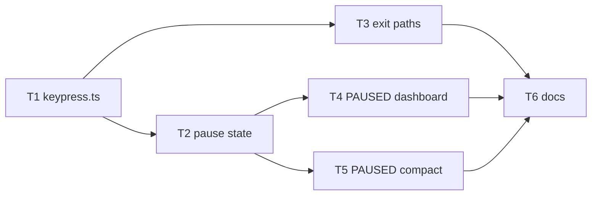

# Epic — pause-resume

> **Spec:** [spec.md](../spec.md) · **Design:** [sad.md](../sad.md) · **ADRs:** [adr/](../adr/)

## Goal

A developer running `pomodoro` can press spacebar to freeze the countdown mid-phase and resume exactly where they left off — with zero lost phase time, no missed or false bell alerts, and the tool's existing Ctrl+C clean-exit guarantee holding identically whether or not a session is paused (spec §2 Goals).

## Scope

- **In:** `src/io/` only — a new `keypress.ts` module, and modifications to `timer.ts`, `render.ts`, `compactLine.ts`. `CLAUDE.md`/`README.md` documentation.
- **Out (spec §3):** re-arming pause capability after a Ctrl+Z/`fg` suspend cycle; fixing stale frames on a terminal resize that happens while paused; guarding against an accidental pause from a stray keystroke; auto-resuming after a timeout. `core/cycle.ts` is explicitly untouched (ADR-0001).

## Task map

T2 and T3 share `src/io/timer.ts` (serialized by `implement`'s overlapping-`files_hint` lane, despite having no dependency edge between them). T4 and T5 touch different files and parallelize freely.

## Tasks

See [tracker.md](./tracker.md) for status. Machine contract: [tasks.json](../tasks.json).

| # | Task | Layer | Blocked by | DoD (short) |
|---|---|---|---|---|
| T1 | Build src/io/keypress.ts: capability-gated keystroke capture | app | — | Capability-fallback + both keys covered by unit tests |
| T2 | Wire pause/resume state into src/io/timer.ts | app | T1 | Fake-timer tests confirm exact freeze + immediate resume-flush |
| T3 | Wire exit-path handling into src/io/timer.ts | app | T1 | cleanup() runs exactly once across every enumerated exit path |
| T4 | Show PAUSED indicator in dashboard render mode | app | T2 | renderFrame() test for both paused states |
| T5 | Show PAUSED indicator in compact render mode | app | T2 | renderCompactLine() test for both paused states |
| T6 | Update CLAUDE.md and README.md to document pause/resume | docs | T3, T4, T5 | Stale "no pause/resume" line removed, keybinding documented |

## Risks / Hard rules

- **Zero new runtime dependencies** (spec §6 NFR row 4) — `node:readline` + `setRawMode` only, no package added.
- **`core/cycle.ts` stays untouched** (ADR-0001) — no task may add a `paused` field to `CycleState` or otherwise touch `core/`.
- **`SIGKILL`/process-group teardown are out of scope by construction** (spec AC-06) — not a gap any task should try to close.
- **Pause/resume is dashboard + compact only** — never wired up in plain mode (spec §1, AC-03).
