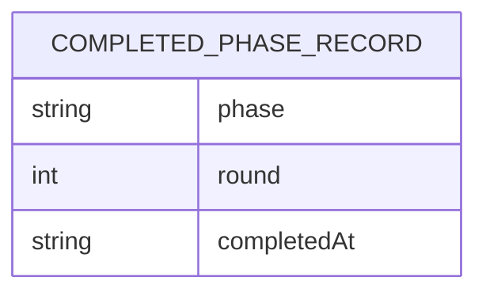

# Data model — session-history

> **No SQL datastore, no migrations.** `docs/architecture-map.md` §Constraints + §Migrations
> ("not applicable — no datastore", `migration_tool: ""`) and this feature's own
> [`adr/0001-introduce-a-new-history-module-called-directly-from-io.md`](adr/0001-introduce-a-new-history-module-called-directly-from-io.md)
> are both explicit: the persistence mechanism is a flat, append-only, write-only file —
> "not a datastore in the sense ADR-0001 excluded — no query engine, no schema migration."
> This is the legitimate **no-schema-change** outcome the `data-model` skill documents rather
> than forces into a relational shape: one record shape, zero staged migrations.

## ER diagram

<!-- single entity, no relationships — there is nothing else to point at (no FK target exists;
spec §3 explicitly excludes any read/query path back into pomodoro itself). -->

## Entities

### `CompletedPhaseRecord`

One JSON line, appended to the history file per `sad.md` §5/§6, per work/break phase that
completes naturally (spec AC-01). Not a table — no PK, no FK, no query engine ever reads it back
from inside `pomodoro` (spec §3 non-goal). Field set and ordering follow `sad.md` §5
(`history/record.ts`).

| Field | Type | Constraints | Notes |
|---|---|---|---|
| `phase` | string | one of `work` / `short_break` / `long_break` | the phase that just completed — `transition.from`, captured before `io` advances local state (sad.md §5) |
| `round` | integer | ≥ 1 | the round the completed phase belonged to, captured pre-tick (sad.md §5 — `nextPhase()` advances round on the `short_break→work`/`long_break→work` edges, so it must be read before the tick) |
| `completedAt` | string | ISO-8601, UTC | timestamp of natural completion (spec AC-01) |

**Aggregate root:** `CompletedPhaseRecord` is its own root — no parent entity exists; the history
file is a flat sequence of independent records, never updated or deleted in place (spec §3:
no rotation, no alternative formats).
**Access patterns:** write-only, one `fs.appendFileSync` per completed phase (sad.md §6 Flow 1/2).
No read access pattern exists inside `pomodoro` to serve — reading the file back is explicitly a
non-goal (spec §3), left to the developer's own external tooling.
**Constraints:** none enforced by a schema — the shape is enforced by `history/record.ts`
constructing the object, not by a validated/migrated column set. No `CHECK`, no `UNIQUE`, no `FK`
— there is nothing on the other end of a relationship to constrain against.

## Indexes

<!-- No index candidates. Every sad.md §6 persist note ("appends one JSON record") has exactly
one access pattern — a blind append — and zero read-side queries to justify an index against;
spec §3 explicitly puts querying/reading out of scope. An index with no concrete query would be
exactly the "just in case" anti-pattern this skill forbids. -->

None. No query exists for this entity inside `pomodoro` (spec §3 non-goal: no read/query path).
Should a later feature add one (e.g. a `pomodoro history` summary command), it would need its own
spec + data-model pass against the then-current access pattern, not a speculative index now.

## Test fixtures

- `buildCompletedPhaseRecord(overrides?)` — returns a `{ phase, round, completedAt }` object with
  safe defaults (`phase: "work"`, `round: 1`, a fixed ISO timestamp), for `history/record.ts` and
  `io/timer.ts` unit tests. No PII risk — the shape carries no name/email/identity fields to begin
  with.
