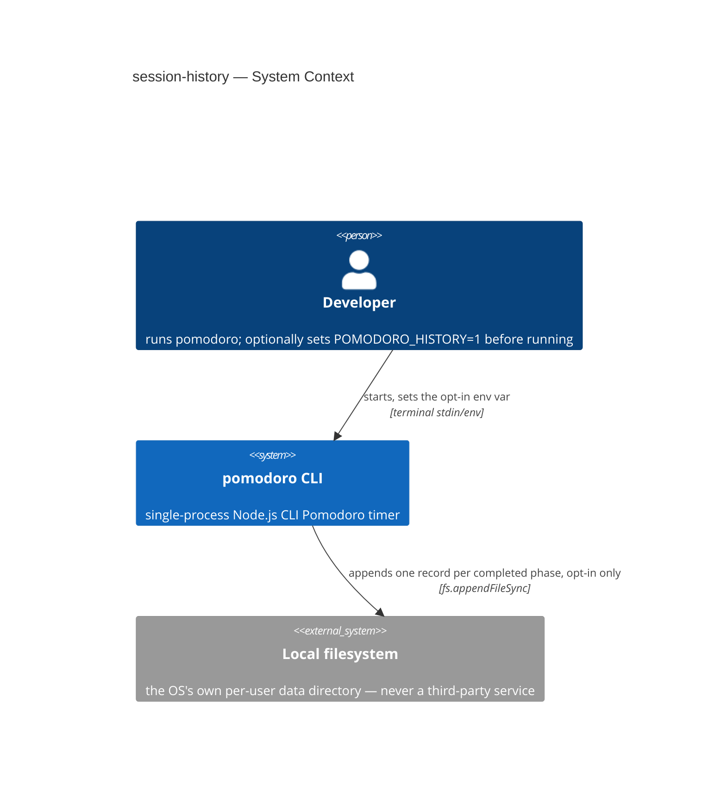
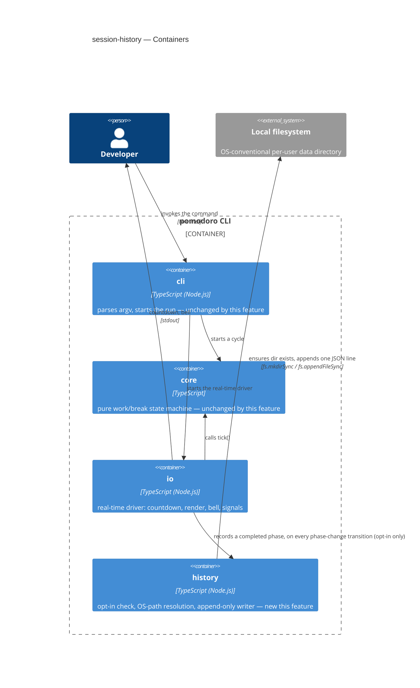
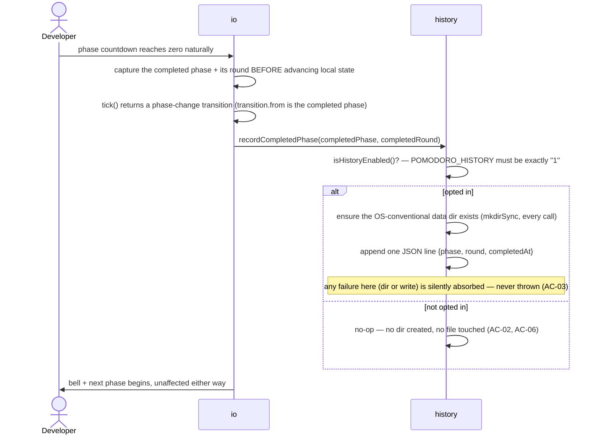

# Software Architecture Document — session-history

<!-- 12 Arc42 sections. Empty section → <!-- N/A: <one-line reason> -->. -->
<!-- C4 Context (L1) lives inline in §3. C4 Container (L2) lives inline in §5. -->
<!-- Numbers in §10 come VERBATIM from spec.md §6 NFR — no inventing, no rounding. -->

## 1. Introduction and goals

**Intent.** Let a developer opt into an append-only record of their own completed work/break phases with a single environment-variable toggle — no code change, no config file, no install step — so they can later tally how many pomodoros they actually finished, while anyone who doesn't opt in sees zero difference from today's tool (spec §2 Goals).

**Top-3 quality goals (1-liners; full scenarios in §10):**

1. Zero-footprint default — bare `pomodoro` (no opt-in) stays byte-for-byte identical in output and behavior.
2. Timer-never-breaks reliability — a history-write failure never crashes, hangs, or delays the countdown.
3. Cross-platform path correctness — the same developer gets a consistent, OS-conventional location on a given machine.

**Stakeholders.**

| Role | Interest | Sign-off owner? |
|---|---|---|
| developer (CONTEXT glossary) | the person running `pomodoro`, optionally opting into history | No |
| Vitalii (owner, solo maintainer) | SAD approval | Yes |

<!-- Decision overrides (¶4) — none this pass; the two spec §8 open questions are resolved by
adopting the spec's own stated defaults (see §4 item 4), not by override. spec.md §8 itself still
needs a follow-up human edit to mark both closed — design does not edit spec.md. -->

## 2. Constraints

**Technical.**
- TypeScript on Node.js (>=18 LTS) — unchanged.
- No framework (`docs/adr/0001-use-nodejs-typescript-with-no-framework-or-datastore.md`) — unchanged. That ADR's "no datastore" framing is narrowly revisited by this feature (a flat append-only file is not a datastore in the sense ADR-0001 excluded — no query engine, no schema migration — but it is persistence, which `docs/architecture-map.md` §Constraints also named; **ADR-0001 (this feature)** records why a new `history` module, not a bolt-on, is the right shape).
- Zero new runtime dependencies (spec §6 NFR row 3) — forces hand-rolled OS-conventional path resolution (no `env-paths`-style package) and Node's built-in `fs.mkdirSync`/`fs.appendFileSync`, not a library.
- Module wiring: direct function calls, no DI container (`docs/adr/0002-thin-cli-core-io-module-split.md`) — unchanged; this feature's `history` module is called directly from `io`, same pattern as `io` calling into `core`.
- Layering: `cli` (entry point, argv) composes `core` + `io` directly; `core` stays pure, zero I/O, zero changes this feature. This feature adds a third module, `history`, called only from `io` — see **ADR-0001**.

**Organisational.**
- Effort budget: S (`docs/features/session-history/.size`) — ≤1 week.
- No hard deadline — personal project (`docs/idea-brief.md` §4).
- Team: solo (Vitalii).

**Conventions.**
- `CLAUDE.md` + `docs/architecture-map.md` — error-handling convention (uncaught → stderr + nonzero exit; SIGINT → immediate exit 0), test convention (`core` unit-tested with a fake clock, `io` gets a thin smoke test only).
- Existing file-splitting pattern in `src/io/` (`render.ts`, `renderMode.ts`, `compactLine.ts`, `phaseColor.ts` — small, single-purpose helpers) — this feature's `history` module follows the same shape (`paths.ts`, `record.ts`), one level up as its own top-level module rather than nested under `io/`, per **ADR-0001**.

**Regulatory / external.**
- N/A — no network surface, no new permission boundary beyond the developer's own OS-level file permissions (spec §6.1 Security review verdict: N/A).

## 3. Context and scope

`pomodoro` remains a single-process CLI the developer runs directly in their own terminal — still one developer, one terminal, one process. This feature adds exactly one new boundary: the local filesystem's OS-conventional per-user data directory, which the process writes to but does not read from, and which can fail independently of the developer's actions (permissions, a full disk, a missing directory) — a fallible external resource, not a remote system.

<!-- brownfield: real scan confirms `src/cli.ts` → `startTimer()` (`src/io/timer.ts`) → `src/core/cycle.ts`'s pure `tick()`; the `setInterval` callback in `timer.ts` already branches on `transition.type === "phase-change"` to fire the bell — that branch IS the "phase completed naturally" signal AC-01 needs. Zero runtime deps today; zero persistence; `io` test convention is `vi.useFakeTimers()` + `vi.spyOn(process.stdout.write)` smoke tests (confirmed in `src/io/timer.test.ts`). -->

**External systems (in / out):**

| Actor or system | Type | Interaction |
|---|---|---|
| developer | Person | runs `pomodoro`, optionally sets `POMODORO_HISTORY=1` before running |
| Local filesystem (OS per-user data dir) | System (external to the process, internal to the developer's own machine) | written to, opt-in only; never read by `pomodoro` itself (spec §3 non-goal) |

**C4 Context (L1):**



## 4. Solution strategy

**Top strategic choices (the seeds for ADRs):**

1. **Target surface: `cli` (existing, unchanged)** — this feature extends the project's one and only surface; no new container or process. Derived from spec §1 "for whom" (the `developer` role) + the project having exactly one deployable. Blast-radius: 0-of-3 (not irreversible, not multi-module beyond the existing single surface, no legitimate alternative — the entire project *is* this CLI) → inline, no ADR. `target_surfaces: [cli]` written to frontmatter.
2. **A new `src/history/` module, called directly from `io` on every phase-change** — `io/timer.ts`'s existing `setInterval` callback, right where it already detects `transition.type === "phase-change"` to fire the bell, also calls `history.recordCompletedPhase(completedPhase, completedRound)` synchronously, using the *completed* phase and round (`transition.from` + the pre-tick round — see §5) rather than the upcoming phase the tick just transitioned into. `core/cycle.ts` and `cli.ts` are both completely untouched — the strongest possible proof that bare `pomodoro` stays byte-for-byte identical (AC-02). This is the one genuine blast-radius decision this pass (irreversible-ish: reversing later means moving files and re-wiring tests; multi-module: touches `io` + a new module + formally revisits ADR-0001/0002's "no persistence" framing per `docs/architecture-map.md` §Constraints; has legitimate alternatives: folding the logic into `io/timer.ts` directly, or having `cli.ts` inject a writer into `io` à la dependency injection) — confirmed with the owner, recorded as **ADR-0001**.
3. **Write mechanism: synchronous `fs.mkdirSync`(recursive) + `fs.appendFileSync`, each independently wrapped in try/catch** — forced by spec §6 NFR's "0 new runtime dependencies" (rules out a path-resolution library) and AC-01's "the append completes... before the next phase's countdown begins" (rules out an async/fire-and-forget write). No legitimate alternative survives both constraints at once → inline, no ADR.
4. **Opt-in toggle: `POMODORO_HISTORY=1`, exact-match, read fresh from `process.env` on each completed phase** — adopts the default spec.md §8 already proposed ("owner: Vitalii, due: before `sdd:design session-history`" — this design pass is that due point). Unset, empty, or any value other than the literal `1` leaves history off (AC-06). Per-call reading rather than a startup-time cache is a deliberate simplification: nothing in this single-process CLI mutates its own environment mid-run, so the two are behaviorally identical for AC-06, and per-call reading is what keeps `isHistoryEnabled()` trivially testable without a module-reload step (review `_review/review-2026-10-06.md` finding #5). Write-failure handling stays fully silent, no trace, ever — the spec's own stated default for its second §8 open question. Both are convention-level, reversible (an env-var name/semantics change is a one-line `paths.ts`/`record.ts` edit, not a rewrite) → inline, no ADR. This resolution is the record of it — spec.md §8 still shows both as open on disk and needs a follow-up human edit (or a light `clarify` pass) to mark them closed; §11's Open-Questions row shape is reserved for items still genuinely deferred, which these no longer are.

## 5. Building block view

Unchanged layered style: `cli` (entry, argv) composes `core` (pure domain, zero I/O) and `io` (real-time driver) directly — no DI container. This feature adds a third module, `history`, called only from `io` (never from `cli` or `core`), per ADR-0001.

**Internal decomposition:**

```
src/
├── cli.ts              <unchanged — entry point, zero changes this feature>
├── core/
│   └── cycle.ts         <unchanged — pure state machine, zero changes this feature>
├── io/
│   └── timer.ts          <modified — on transition.type === "phase-change", calls history.recordCompletedPhase(transition.from, completedRound) synchronously, alongside the existing bell. completedRound MUST be captured from the pre-tick state.round before the local `state` variable is reassigned to transition.state — nextPhase() (core/cycle.ts) advances round on the short_break→work and long_break→work edges, so by the time the post-tick state is in hand, its round no longer identifies the phase that just completed>
└── history/
    ├── paths.ts           <new — resolves the OS-conventional per-user data dir; pure function of process.platform + env (XDG_DATA_HOME / HOME / LOCALAPPDATA), paths already settled by docs/roadmap.md>
    └── record.ts          <new — isHistoryEnabled() reads POMODORO_HISTORY fresh on each call; recordCompletedPhase(completedPhase, completedRound) ensures the dir exists (mkdirSync, independently every call) and appends one JSON line {phase: completedPhase, round: completedRound, completedAt}; both the mkdir and the append are independently try/catch'd — any failure is silently absorbed, never thrown (AC-03)>
```

**C4 Container (L2):**



## 6. Runtime view

**Critical flow 1: A completed phase is recorded**



**Critical flow 2: A history-write failure never breaks the timer**

```mermaid
sequenceDiagram
    participant <service>
    participant <data-store>
    Note over <service>: precondition — developer has opted in; a phase has just completed naturally
    <service>->><data-store>: ensure the OS-conventional data directory exists (every call, independently)
    alt directory ensure fails
        Note over <service>: failure silently absorbed — no record attempted, never thrown (AC-03)
    else directory ensure succeeds
        <service>->><data-store>: append one JSON record for the completed phase
        alt append fails
            Note over <service>: failure silently absorbed — never thrown, never surfaced to the developer (AC-03)
        else append succeeds
            Note over <service>,<data-store>: persists completed-phase record {phase, round, completedAt}
        end
    end
    Note over <service>: the countdown continues unaffected either way — the next completed phase independently attempts its own write regardless of this outcome
```

**Critical flow 3: An interrupted phase is never recorded**

```mermaid
sequenceDiagram
    participant <client>
    participant <service>
    Note over <service>: precondition — developer has opted in; a phase is mid-countdown
    <client>->><service>: sends an interrupt (Ctrl+C) or terminate/hang-up signal before the countdown reaches zero
    <service>->><service>: exits immediately per the project's existing signal handling — no phase-change transition is ever produced for this phase
    Note over <service>: the history-write step is never reached for this phase — no record exists, regardless of how late the interruption occurs (AC-04)
    <service>->><client>: process exits, code 0
```

**Coverage check (§4 user stories → flow, §5 ACs → flow/branch/N/A):**

| US / AC | Covered by |
|---|---|
| US-01 Turn session history on | Flow 1 (`isHistoryEnabled()` branch) |
| US-02 See completed phases recorded | Flow 1 (happy path) |
| US-03 Keep default behavior unchanged | Flow 1 (`else not opted in` branch) |
| US-04 Find history in a predictable place | N/A — not a distinct runtime path; see AC-05 below |
| US-05 Keep interrupted sessions out of my history | Flow 3 |
| US-06 Never let logging break my timer | Flow 2 |
| AC-01 (US-01, US-02) happy path | Flow 1 |
| AC-02 (US-03) happy path | Flow 1 (`else not opted in`) |
| AC-03 (US-06) error | Flow 2 (both `alt` branches) |
| AC-04 (US-05) domain invariant | Flow 3 |
| AC-05 (US-04) cross-context | **N/A, non-runtime** — OS-conventional path resolution is a pure-function branch on `process.platform` inside `history/paths.ts`; every OS produces the same message shape in Flow 1/2, differing only in the literal path value, so it carries no distinct sequence to draw. |
| AC-06 (US-01) authorization | Flow 1 (`isHistoryEnabled()` branch) |

No §4 user story or §5 AC is left uncovered.

**Flagged for design/data-model:** none — Flow 2/3 introduce no participant beyond `<service>`/`<data-store>`/`<client>`, all already implied by §5's `history`/filesystem boundary; no new ADR-worthy decision surfaced during this pass.

## 7. Deployment view

<!-- N/A: reuses the existing deployment unit — a locally-run CLI process on the developer's own machine, started via npm link/global install. No infra, no replicas, no new scaling concern; the only new "deployment" fact is a file on the developer's own disk, sized by how long they keep the tool opted in (accepted, spec §3 non-goal: no rotation). -->

## 8. Crosscutting concepts

| Concept | Convention | Where defined |
|---|---|---|
| Persistence / file I/O | A single new module, `history/`, owns all filesystem access; `core` and `cli` never touch it (ADR-0001) | `src/history/record.ts`, `src/history/paths.ts` |
| Error handling (history-specific) | Every history write failure is silently absorbed — mkdir and append independently try/catch'd, never surfaced, never crashes the timer (spec AC-03) | `src/history/record.ts` |
| Error handling (project-wide) | Unchanged — uncaught errors to stderr, nonzero exit; `SIGINT` exits immediately with code 0 | `CLAUDE.md` |
| ID strategy | N/A — no persisted entity has an id; each record is a timestamped fact, not a referenceable row | — |
| Internationalisation | N/A — single language, unchanged | — |
| Observability | N/A — no telemetry, by design (`docs/idea-brief.md` §5); the history file itself is the developer's own artifact, not observability data | — |
| Inter-module communication | Direct function calls only — `io` calls `history` the same way it calls `core`; no event bus (`docs/adr/0002-thin-cli-core-io-module-split.md`) | `src/io/timer.ts` |

## 9. Architecture decisions

| # | Title | Status | Section |
|---|---|---|---|
| 0001 | Introduce a new history module, called directly from io | Accepted | §4 |

ADR files live under `docs/features/session-history/adr/NNNN-<title>.md`.

## 10. Quality requirements

**QG-1. Zero-footprint default**
- **When:** a developer has not set the opt-in environment variable.
- **Then:** no history file is created or written to, and `pomodoro`'s printed output and behavior are identical to a version of the tool with no session-history capability at all (spec AC-02, AC-06).
- **How verify:** test asserting `pomodoro`'s stdout + exit behavior over a full cycle is unchanged with the env var unset, and that no file appears under the conventional data dir.

**QG-2. Timer-never-breaks reliability**
- **When:** a developer has opted in and a history-write attempt (mkdir or append) fails for any reason — permissions, a full disk, a missing directory that can't be created.
- **Then:** 100% of simulated write failures leave the countdown running, unaffected — no crash, hang, or missed tick (spec §6 NFR row 2); the next completed phase independently attempts its own write regardless of whether this one failed (AC-03).
- **How verify:** unit test in `history`/`io` simulating a failing write, asserting ticks continue uninterrupted.

**QG-3. Cross-platform path correctness**
- **When:** a developer runs `pomodoro` with history enabled on a given operating system and a phase completes.
- **Then:** the record is written to that OS's own conventional per-user data location — `$XDG_DATA_HOME` or `~/.local/share/pomodoro-timer/` on Linux, `~/Library/Application Support/pomodoro-timer/` on macOS, `%LOCALAPPDATA%\pomodoro-timer\` on Windows (spec AC-05; paths settled in `docs/roadmap.md`) — with nothing for the developer to configure.
- **How verify:** unit test on `history/paths.ts` covering all three `process.platform` branches with controlled env vars.

**QG-4. History-write added latency**
- **When:** a developer has opted in and a phase completes.
- **Then:** the synchronous append adds ≤ 5ms to the existing phase-transition write path, measured as real wall-clock time (spec §6 NFR row 1).
- **How verify:** integration test timing the write call against a real temp-file write, not a fake double.

## 11. Risks and technical debt

| Risk / debt | Severity | Mitigation | Owner |
|---|---|---|---|
| The history file grows indefinitely over long-term use | Low | Accepted non-goal (spec §3: no rotation/size limits); the developer can delete the file themselves at any time | Vitalii |
| Another process or user could set `POMODORO_HISTORY` without the developer's knowledge | Low | Prevented in effect by AC-06 (only this invocation's own environment, read at its own startup, decides); documented in `README.md` per spec §6.1 Definition-of-Done note | Vitalii |
| `docs/architecture-map.md` §Constraints ("the foundation deliberately excludes persistence") and `CLAUDE.md`'s module-structure section (which lists only `cli`/`core`/`io`) both go stale the moment this feature ships | Low | This SAD + ADR-0001 are the formal revisit the constraint calls for; recommend re-running `survey` after this feature ships to refresh `architecture-map.md`, and updating `CLAUDE.md`'s module list to add `history/` | Vitalii |

**Accepted debt (acceptable in v1, plan to fix later):**
- None beyond the non-goals the spec already named and accepted (no read/query path, no rotation, no config-file alternative to the env var — spec §3).

## 12. Glossary

| Term | Meaning |
|---|---|
| developer | the person running `pomodoro` in their own terminal — see `CONTEXT.md` |
| session history | the opt-in, append-only record of completed work/break phases, written to the platform's conventional data directory — see `CONTEXT.md` |
| completed phase | a work/break phase whose countdown reached zero naturally (including a pause/resume's deferred transition flushing on resume) — see `CONTEXT.md` |
