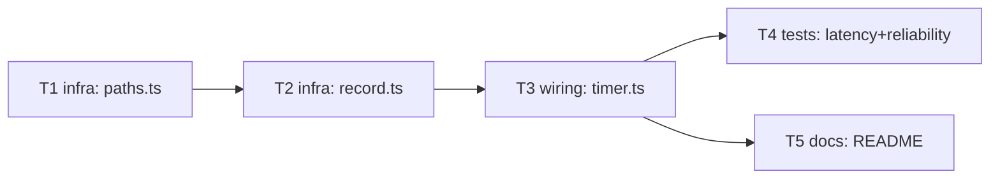

# Epic — session-history

> **Spec:** [spec.md](../spec.md) · **Design:** [sad.md](../sad.md) · **Data model:** [data-model.md](../data-model.md) · **API:** Internal — no API surface (`api` stage auto-skipped, see `data-model`'s audit report) · **ADRs:** [adr/](../adr/)

## Goal

Let a developer opt into an append-only record of their own completed work/break phases with a single environment-variable toggle, so they can later tally how many pomodoros they actually finished — while anyone who doesn't opt in sees zero difference from today's tool (`spec.md §2` Goals).

## Scope

- **In:** a new `history` module (`paths.ts` resolving the OS-conventional data dir, `record.ts` gating + writing), one call site added to `io/timer.ts`, the integration tests proving the NFR bounds, and the README documentation `spec.md §6.1` requires.
- **Out:** reading/querying/summarizing the history (`spec.md §3`), recording interrupted phases (`spec.md §3`), a CLI flag or config file for the opt-in (`spec.md §3`), file rotation/size limits (`spec.md §3`) — all explicit non-goals.

## Task map

## Tasks

See [tracker.md](./tracker.md) for status. Machine contract: [tasks.json](../tasks.json).

| # | Task | Layer | Blocked by | DoD (short) |
|---|---|---|---|---|
| T1 | Implement OS-conventional history-directory resolution | infra | — | `paths.test.ts` covers all 3 `process.platform` branches |
| T2 | Implement opt-in gate + isolated append-only writer | infra | T1 | `record.test.ts`: happy path, opt-out no-op, both failure-isolation cases |
| T3 | Wire completed-phase recording into `io/timer.ts` | wiring | T2 | `timer.test.ts` asserts the call on phase-change, never on SIGINT; `cli.ts`/`core/cycle.ts` diff is empty |
| T4 | Integration-test latency + full-cycle default-behavior guarantees | tests | T3 | 3 integration tests pass against real temp-file I/O, no fake double |
| T5 | Document the opt-in variable and history file location in README | docs | T3 | README alone is enough to opt in and find the file |

## Risks / Hard rules

- **Hard rule (ADR-0001 / sad.md §4 item 2):** `src/core/cycle.ts` and `src/cli.ts` must have zero line changes from this epic — the only proof strong enough for AC-02's "byte-for-byte identical" claim. T3 enforces this.
- **Hard rule (sad.md §4 item 4 / spec.md §8):** write-failure handling is fully silent, forever — no trace, no retry, no queue. T2 and T4 enforce this.
- **NFR (spec.md §6 row 1):** history-write added latency ≤5ms, measured against a real temp-file write — T4's own constraint, never a mocked `fs`.
- **Risk (sad.md §11):** `docs/architecture-map.md` and `CLAUDE.md`'s module list go stale the moment this epic ships (both already named `history/` informally — a full `survey` re-run after shipping is recommended, out of this epic's scope).
